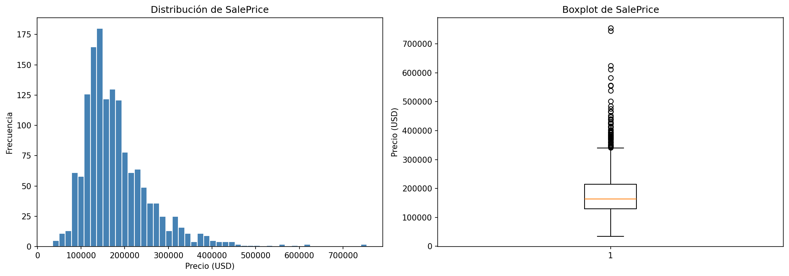
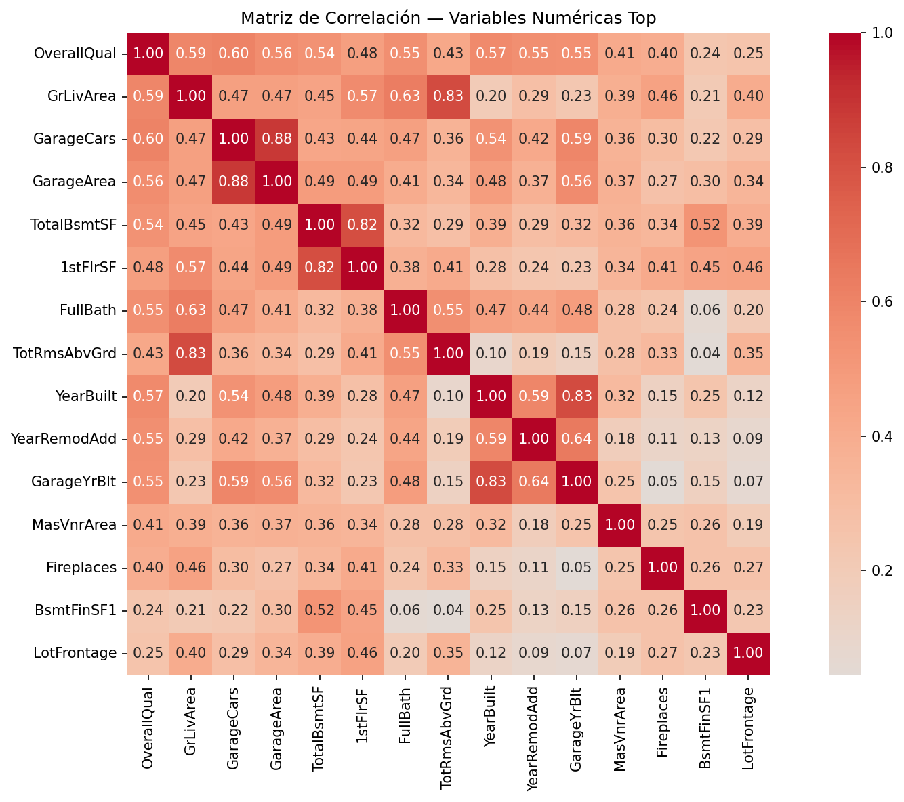
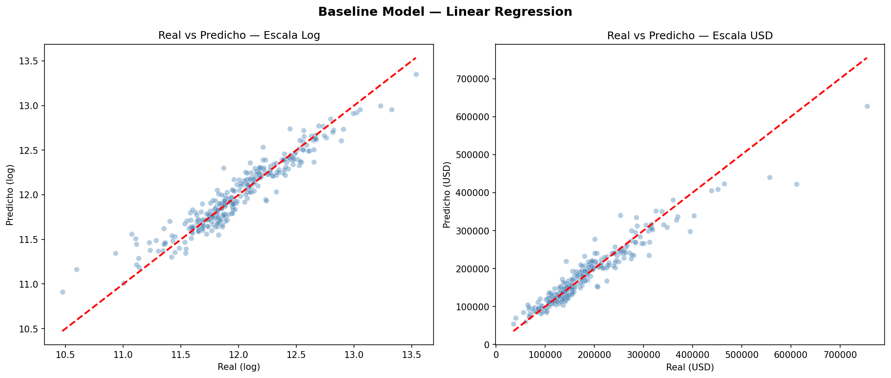
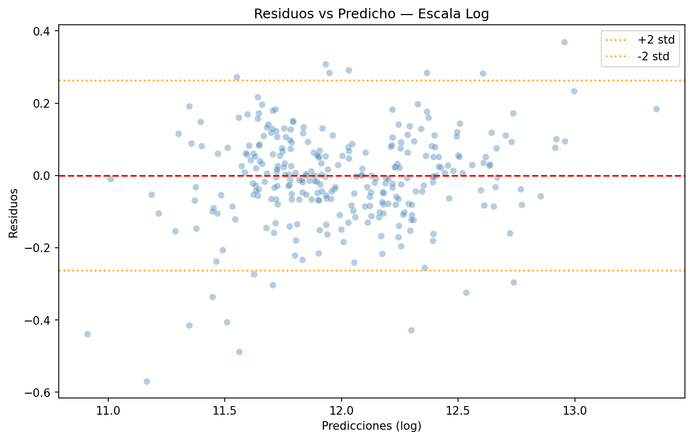
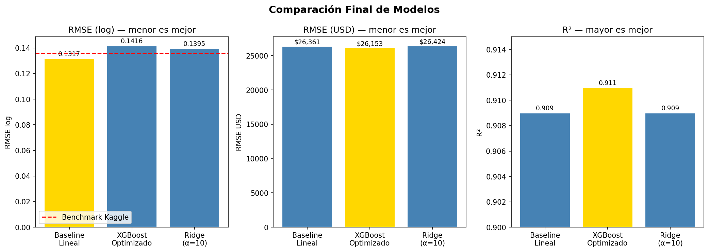
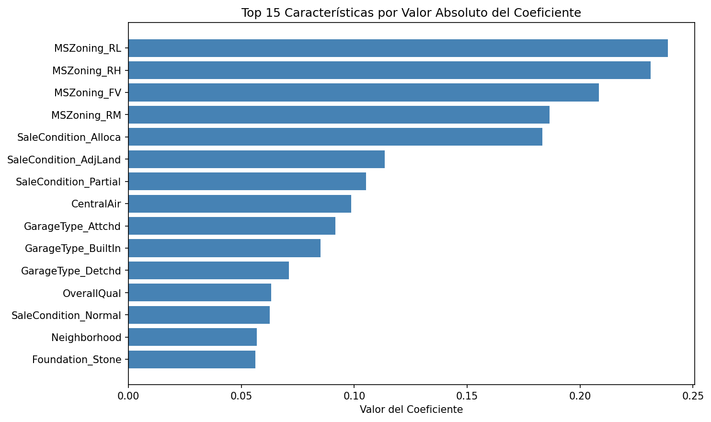
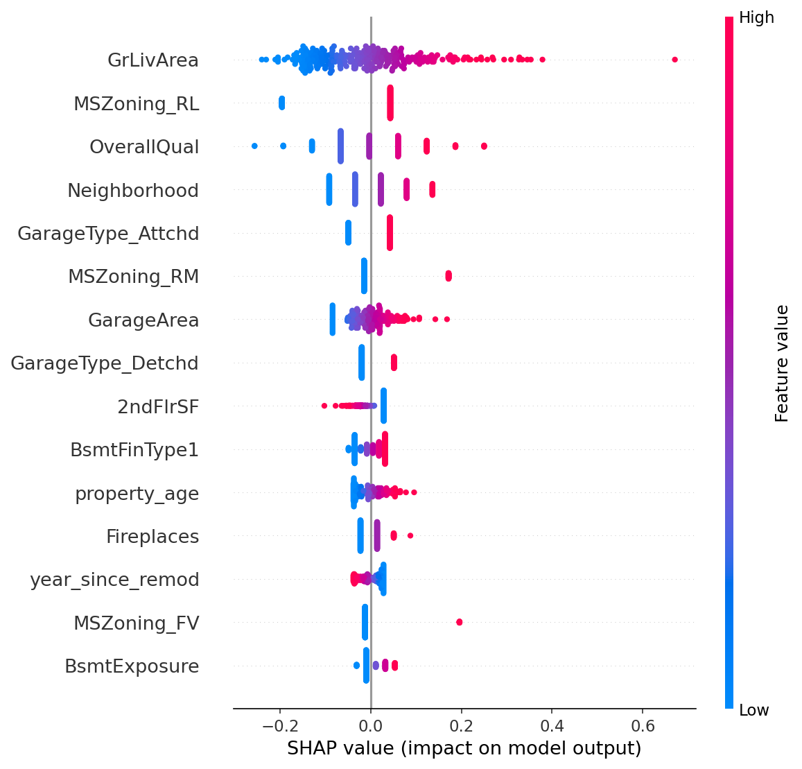

# 📊 Vortex Ames Housing — Predicción de Precios Inmobiliarios

> Modelo de regresión para predecir el precio de venta de propiedades
> residenciales en Ames, Iowa, usando el dataset de Kaggle House Prices.

---

## 🗂️ Tabla de Contenidos
- [Pregunta de Negocio](#pregunta-de-negocio)
- [Dataset](#dataset)
- [Tecnologías y Librerías](#tecnologías-y-librerías)
- [Desarrollo](#desarrollo)
- [Resultados](#resultados)
- [Cómo Replicar](#cómo-replicar)
- [Referencias](#referencias)

---

## ❓ Pregunta de Negocio

¿Es posible predecir con precisión el precio de venta de una propiedad
residencial en Ames, Iowa, a partir de sus características estructurales,
de calidad y de ubicación? El modelo busca minimizar el RMSE por debajo
del benchmark de la competencia de Kaggle (RMSE log < 0.1358).

---

## 📁 Dataset

| Campo | Detalle |
|-------|---------|
| **Fuente** | [Kaggle — House Prices: Advanced Regression Techniques](https://www.kaggle.com/c/house-prices-advanced-regression-techniques) |
| **Descripción** | Propiedades residenciales vendidas en Ames, Iowa entre 2006-2010 |
| **Dimensiones** | 1,460 filas x 81 columnas (raw) → 1,460 x 47 (procesado) |
| **Target** | SalePrice — transformado con np.log() para corregir sesgo positivo |
| **Variables clave** | OverallQual, GrLivArea, GarageArea, TotalBsmtSF, Neighborhood |

---

## 🛠️ Tecnologías y Librerías

**Lenguaje:** Python 3.x

| Librería | Uso |
|----------|-----|
| `pandas` | Manipulación y limpieza de datos |
| `numpy` | Operaciones numéricas y transformaciones |
| `matplotlib` / `seaborn` | Visualización de datos y métricas |
| `scikit-learn` | Modelado, encoding, evaluación y GridSearchCV |
| `xgboost` | Modelo avanzado de gradient boosting |
| `shap` | Interpretabilidad del modelo — SHAP Values |
| `scipy` | Pruebas estadísticas ANOVA en EDA |

---

## 🔍 Desarrollo

### Etapa 1: EDA — Análisis Exploratorio (`src/notebooks/01_eda.ipynb`)
Se analizó la distribución del target y se identificaron las variables
más relevantes. SalePrice presentó sesgo positivo — se aplicó log transform.
Top correlaciones: OverallQual (0.79), GrLivArea (0.71). Se detectaron
4 pares de variables con multicolinealidad y se ejecutó ANOVA para
variables categóricas (ExterQual F=443, KitchenQual F=408).

```python
df['SalePrice_log'] = np.log(df['SalePrice'])
```




### Etapa 2: Missing Values (`src/notebooks/02_missing_values.ipynb`)
Se identificaron 19 columnas con nulos. Se distinguieron nulos
estructurales (ausencia real de la característica) de nulos reales.
15 columnas codificadas como "None" o 0. LotFrontage imputado
con mediana por Neighborhood.

```python
df = pd.read_csv(path, keep_default_na=False, na_values=[''])
```

### Etapa 3: Feature Engineering (`src/notebooks/03_feature_engineering.ipynb`)
Se aplicaron tres estrategias de encoding según el tipo de variable:
Ordinal Encoding para variables con jerarquía natural, One-Hot Encoding
con drop=first para nominales, y Binary Encoding para dicotómicas.
Se crearon features temporales y se agrupó Neighborhood en 5 segmentos.

```python
property_age     = YrSold - YearBuilt
year_since_remod = YrSold - YearRemodAdd
```

### Etapa 4: Baseline Model (`src/notebooks/04_baseline_model.ipynb`)
Regresión lineal como punto de referencia. Evaluación con RMSE, R²,
MAE y K-Fold Cross Validation (cv=10) para verificar estabilidad.
Análisis visual con gráficos de residuos y distribución de errores.




### Etapa 5: Modelos Avanzados (`src/notebooks/05_advanced_model.ipynb`)
Se entrenaron XGBoost con GridSearchCV (27 combinaciones, cv=5)
y Ridge Regression con RidgeCV. Comparación sistemática contra baseline.



### Etapa 6: Interpretación (`src/notebooks/06_interpretacion.ipynb`)
Feature importance por coeficientes y SHAP Values para explicar
el impacto individual de cada variable sobre la predicción.

---

## 📈 Resultados

### Comparación de Modelos

| Modelo | RMSE (log) | RMSE (USD) | R² |
|--------|-----------|------------|-----|
| **Baseline Lineal** | **0.1317** | $26,361 | 0.909 |
| XGBoost Optimizado | 0.1416 | **$26,153** | **0.911** |
| Ridge (α=10) | 0.1395 | $26,424 | 0.909 |
| Benchmark Kaggle | 0.1358 | — | — |

El modelo baseline de regresión lineal obtuvo el mejor RMSE en escala
logarítmica — métrica oficial de Kaggle — superando la mediana del
leaderboard (0.13584).

### Hallazgos principales — SHAP Values
- **GrLivArea** es el driver principal del precio con diferencia
- **OverallQual** y **Neighborhood** son más relevantes que la antigüedad
- Remodelar antes de vender tiene impacto limitado en el precio predicho
- Zonas residenciales de baja densidad (MSZoning_RL) tienen impacto positivo consistente




---

## ⚙️ Cómo Replicar

### Requisitos
- Python 3.8+
- Instalar dependencias:

```bash
pip install pandas numpy matplotlib seaborn scikit-learn xgboost shap scipy
```

### Pasos

1. Clona el repositorio:
```bash
git clone https://github.com/FelipeCH13/vortex-ames-housing.git
cd vortex-ames-housing
```

2. Descarga el dataset desde Kaggle y colócalo en `data/`:

3. Ejecuta los notebooks en orden:

```
src/notebooks/01_eda.ipynb
src/notebooks/02_missing_values.ipynb
src/notebooks/03_feature_engineering.ipynb
src/notebooks/04_baseline_model.ipynb
src/notebooks/05_advanced_model.ipynb
src/notebooks/06_interpretacion.ipynb
```

## 🔗 Referencias

- [Kaggle — House Prices: Advanced Regression Techniques](https://www.kaggle.com/c/house-prices-advanced-regression-techniques)
- [Documentación scikit-learn](https://scikit-learn.org/stable/)
- [SHAP Library](https://shap.readthedocs.io/en/latest/)
- [XGBoost Documentation](https://xgboost.readthedocs.io/)
- [Dean De Cock — Ames Housing Dataset Paper (2011)](http://jse.amstat.org/v19n3/decock.pdf)

---

*Desarrollado por Felipe CH — 2026*